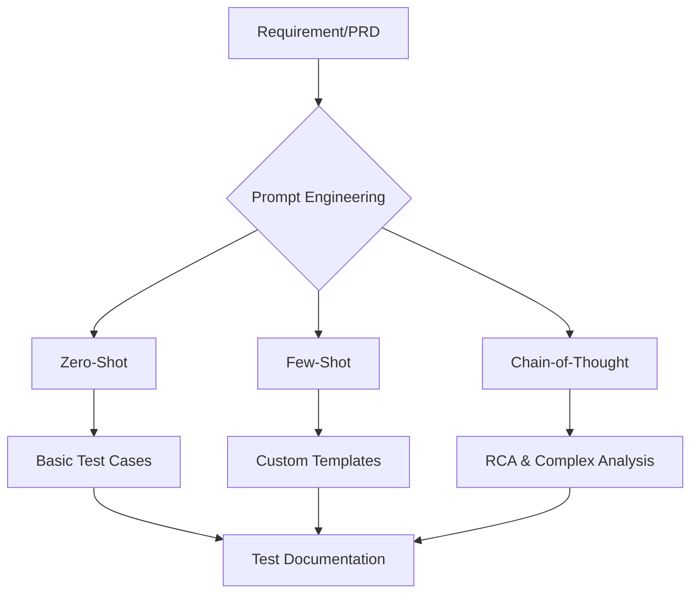

# Professional Prompt Engineering for QA & Testing

This repository contains a collection of advanced prompt engineering artifacts designed for Senior QA Managers, Architects, and Engineers. Each file demonstrates specific techniques such as **Zero-Shot**, **Few-Shot**, and **Chain-of-Thought (CoT)** prompting to solve complex testing challenges.

## 🚀 Project Overview

The goal of this project is to showcase how specialized AI prompting can automate and enhance the software testing life cycle (STLC), from requirement analysis to security and performance test design.

### 🏛️ Architecture & Methodology

---

## 📂 File Structure & Key Artifacts

| File Name | Role / Technique | Description |
| :--- | :--- | :--- |
| `vwo_login_test_cases.md` | Senior QA Architect | 15+ comprehensive test cases for VWO login (Functional, UI, Perf). |
| `bstackdemo_advanced_payment_test_cases.md` | Senior QA Manager | Multi-method payment testing & 3D Secure OTP flows. |
| `petstore_delete_pet_test_cases.md` | API QA & Security | Input validation & OWASP security testing for REST endpoints. |
| `chain_of_thought.md` | Senior QA Engineer | Deep-dive coverage analysis using CoT methodology. |
| `complete_prompt_construction.md` | 10+ Yr Senior QA | PRD to Test Case transformation with explicit constraint handling. |
| `right_prompting.md` | Methodology Guide | Detailed breakdown of when to use Zero-Shot vs CoT. |
| `role_selection.md` | Specialist Roles | Mapping of specialized testing roles (Accessibility, Security, etc.) to tasks. |

---

## 🛠️ Prompting Strategies Used

### 1. Chain-of-Thought (CoT)
Used for **Complex Coverage Analysis** (`chain_of_thought.md`). The AI is instructed to step through extraction, verification, and matrix generation sequentially to ensure no gaps are missed.

### 2. Constraint-Based Prompting
Used for **PRD Analysis** (`complete_prompt_construction.md`). Strict rules prevent the "hallucination" of features not present in the requirement and force the identification of "Needs Clarification" items.

### 3. Role-Based Persona
Each artifact is generated from a specific persona (e.g., *Security Auditor* or *Performance Engineer*) to ensure the correct depth and technical vocabulary.

---

## 📞 Support & Feedback
For any questions regarding the prompting frameworks used in this repository, please refer to the `right_prompting.md` guide.
